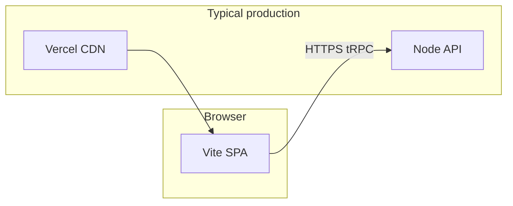

# Architecture overview

Single-organization **NRCS EAM**: one deployment, **PostgreSQL** (Supabase), Express + tRPC API, Vite + React SPA.

## Environment loading

| Context | How config is loaded |
|--------|----------------------|
| **Server** ([`server/_core/index.ts`](../server/_core/index.ts)) | `import "dotenv/config"` loads **`.env` from the process current working directory** (run via `pnpm dev` / `pnpm start` from the **repository root**). Then [`loadSecrets`](../shared/loadSecrets.ts) merges **AWS Secrets Manager** into `process.env` when `AWS_SECRETS_SECRET_ID` is set. |
| **DB utility scripts** ([`scripts/db/`](../scripts/db/)) | Load **`.env` explicitly** from the repo root (`join(__dirname, '../../.env')`) so they behave correctly even if the shell’s cwd is not the project root. |
| **Vite client** | `VITE_*` variables are baked in at **build time** (Vercel/CI), not read from the API host’s `.env` at runtime. |

**Avoid drift:** always run app and scripts from the repo root unless you know the implications. Production API should set env on the **API host** (or Vercel serverless env if applicable), not rely on a checked-in `.env`.

## Authentication

| Mechanism | Entry | Notes |
|-----------|--------|--------|
| **Supabase** | Password + magic link via tRPC [`authRouter`](../server/routers/authRouter.ts); httpOnly cookies for session. | |
| **Legacy OAuth redirect** | `GET /api/oauth/callback` redirects to **`/login`** (Manus OAuth removed). | |
| **Magic link** | Email from Supabase; SPA [`/auth/verify`](../client/src/pages/VerifyMagicLink.tsx) exchanges tokens via tRPC. | |
| **Session** | [`createContext`](../server/_core/context.ts) resolves the user for tRPC from Supabase JWT + `users` table. |

Global tRPC **401** handling in [`client/src/main.tsx`](../client/src/main.tsx) may send the browser to **`getLoginUrl()`** (`/login`). In-app navigation to **`/app/*`** without a session uses **`ProtectedRoute`** → **`/login`**.

## Routing model (SPA)

Wouter routes are defined in [`client/src/App.tsx`](../client/src/App.tsx) and [`client/src/components/ProtectedAppSection.tsx`](../client/src/components/ProtectedAppSection.tsx). Helpers: [`client/src/lib/routes.ts`](../client/src/lib/routes.ts).

| Area | Paths | Layout |
|------|--------|--------|
| Public | `/`, `/login`, `/signup`, `/auth/verify`, `/legal/*` | No dashboard shell |
| App shell | `/app`, `/app/assets`, … | `DashboardLayout` + `ProtectedRoute` |

See [ADR 0001](ADR/0001-app-routing-and-auth-surfaces.md) for the routing/auth decision.

## Further reading

- [CUSTOM_DOMAINS_VERCEL_AWS.md](CUSTOM_DOMAINS_VERCEL_AWS.md) — domains, `FRONTEND_ORIGIN`, CORS, Vercel build env
- [AWS_RDS.md](AWS_RDS.md) — legacy RDS notes (this app uses **Supabase Postgres** in production)
