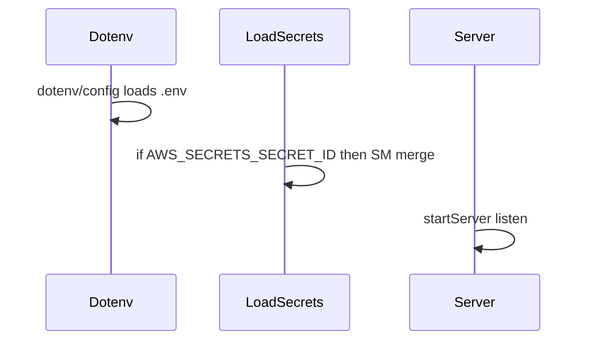
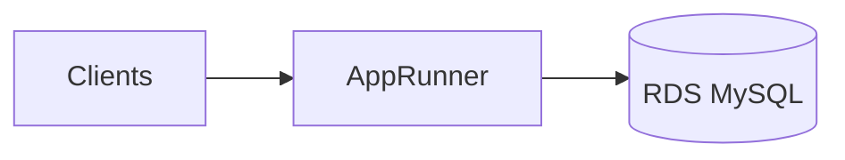

# AWS App Runner (backend)

This app is **TypeScript**: production entry is **`dist/index.js`** (from `esbuild`), not `server/_core/index.js`. The client static files live under **`dist/public/`**.

## Local check (same as App Runner)

```bash
pnpm install
pnpm build
pnpm start
```

You should see `Server running on http://localhost:3000/` (or another port if 3000 is busy).

## App Runner build and start commands

| Field | Value |
|--------|--------|
| **Build** | `npm install -g pnpm && pnpm install && pnpm run build` |
| **Start** | `pnpm start` |
| **Port** | `3000` (or set `PORT` in env) |

Do **not** use only `pnpm install` as the build step—you must run **`pnpm run build`** so `dist/index.js` and `dist/public/` exist.

**Runtime:** Node.js **20** or **22** (see `engines` in `package.json`).

## Environment variables

**Recommended:** store sensitive values in **AWS Secrets Manager** as a JSON object, then set only:

| Variable | Notes |
|----------|--------|
| `AWS_SECRETS_SECRET_ID` | e.g. `nrcs-eam/prod/app` |
| `AWS_REGION` | e.g. `eu-west-1` |

The app loads the secret at startup ([`shared/loadSecrets.ts`](../shared/loadSecrets.ts)) and merges keys into `process.env`. The **App Runner instance role** (or access role) must allow **`secretsmanager:GetSecretValue`** on that secret’s ARN.

Alternatively, set variables directly in App Runner (less ideal for secrets):

| Variable | Notes |
|----------|--------|
| `DATABASE_URL` | MySQL URL to RDS |
| `DATABASE_SSL` | `true` for RDS |
| `DATABASE_SSL_REJECT_UNAUTHORIZED` | `true` in production when using RDS CA PEM |
| `DATABASE_SSL_CA_PATH` | e.g. `./certs/global-bundle.pem` — see [AWS_RDS.md](AWS_RDS.md) Phase 2 |
| `JWT_SECRET` | Session signing |
| `PORT` | App Runner may inject; app respects `PORT` |

## Startup order



## VPC connector (required for private RDS)

1. App Runner → **Networking** → enable **VPC access**.
2. Create a **VPC connector** in the **same VPC** as RDS.
3. Use **private subnets** with routes that can reach RDS (and NAT for outbound if needed).
4. Attach a **security group** for the connector.

## RDS security group

On the **RDS** security group, inbound:

- **Type:** MySQL (3306)
- **Source:** the **App Runner VPC connector** security group (not `0.0.0.0/0`).

## After deployment

- Turn **RDS public access** **OFF** if it was on for bootstrap.
- Prefer **Secrets Manager** for DB password and `JWT_SECRET` instead of plain text in App Runner env UI.

## Architecture



Frontend can be hosted separately (e.g. Vercel) calling this API origin, or serve the built SPA from the same process (`dist/public`).
