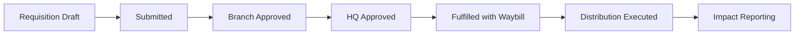
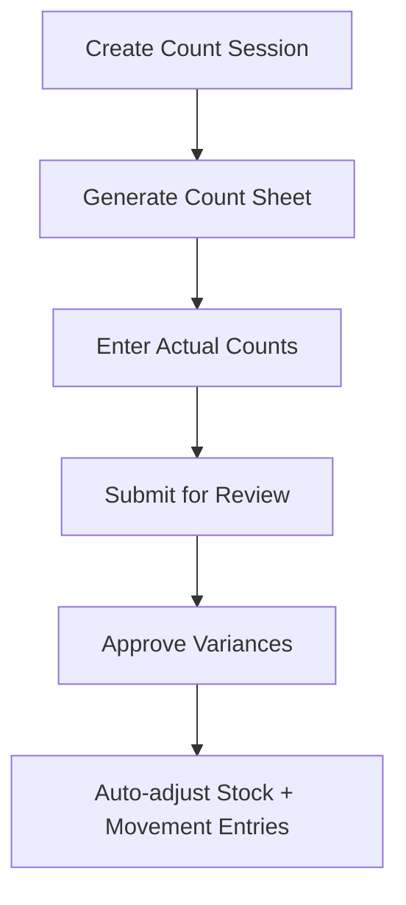

# NRCS Inventory System Guide

## Roles and Permissions
- `staff`: create operational documents (GRN/Waybill/Counts), update zone locations, execute approved workflows.
- `manager`: all staff actions plus approvals, review operations, and report access.
- `admin`: full control including imports/exports, scheduled report management, and system-level actions.

## End-to-End Workflow

## GRN Process (Receipts)
1. Create GRN with warehouse, reference, and line items.
2. Manager/admin approves GRN.
3. Stock increases; batches are created when batch/expiry is provided.
4. Movement log captures receipt transaction for audit.

## Waybill Process (Issues)
1. Create waybill from origin warehouse with destination and lines.
2. Manager/admin approves.
3. Staff/manager/admin dispatches.
4. FEFO batch consumption is applied for expirable stock.

## Transfer Process
1. Create transfer note (origin to destination warehouse).
2. Admin approves.
3. Dispatch decrements source and increments destination in-transit.
4. Receive completes transfer and moves quantity to on-hand at destination.

## Requisition Approval and Fulfillment
- Status path: `draft -> submitted -> branch_approved -> hq_approved -> fulfilled`.
- Rejection path: from submitted/approved stages to `rejected` with reason.
- Fulfillment creates a waybill and links it to the requisition.

## Cycle Counting

## Kits (Assembly / Disassembly)
- Assembly consumes component stock and increments kit stock.
- Disassembly decrements kit stock and restores components.
- Every operation writes adjustment movement records and assembly history.

## Reports and Analytics Definitions
- `stockStatus`: warehouse x category stock health and valuation snapshot.
- `stockMovement`: period movement totals, turnover, fast/slow movers.
- `expiryForecast`: 30/60/90/180 day risk and historical expiry loss view.
- `distributionSummary`: humanitarian reach, demographics, and response timing.
- `vedAnalysis`: inventory criticality by value/service level.
- `abcAnalysis`: consumption-value segmentation (A/B/C).
- `fnsAnalysis`: movement frequency segmentation (Fast/Normal/Slow + dead stock).
- `warehouseUtilization`: per-warehouse throughput and stock accuracy indicators.
- `forecastDemand`: monthly averages, rolling forecast, reorder suggestions.

## Scheduled Jobs
- Daily (`/api/cron/daily` @ 02:00 UTC): low/critical stock checks, expiry checks, notifications.
- Weekly (`/api/cron/weekly` @ Mondays 06:00 UTC): reorder candidates and operational summary.
- Monthly (`/api/cron/monthly` @ day 1 06:00 UTC): forecast refresh and warehouse scorecards.
