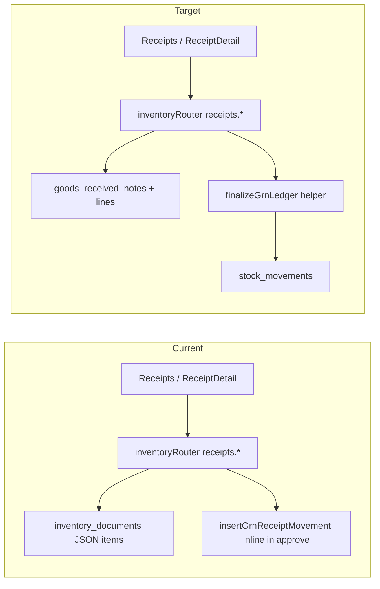

# Phase 4b: GRN Relational Migration

## Goal

Move **new** GRN create / draft / approve flows from legacy [`inventory_documents`](../../drizzle/schema.ts) JSON blobs to relational [`goods_received_notes`](../../drizzle/schema.ts) + [`goods_received_note_lines`](../../drizzle/schema.ts), with ledger writes via a shared helper in [`server/wms/grnStockLedger.ts`](../../server/wms/grnStockLedger.ts).

**Out of scope (deferred):** bulk backfill of existing `inventory_documents` GRNs. Legacy rows remain readable via dual-read; new rows write only to relational tables.

**Independent of:** Phase 4d (`distributions.waybill_id` FK) — see [`4d-distributions-waybill-fk-migration.md`](./4d-distributions-waybill-fk-migration.md).

---

## Current vs Target

---

## Decisions

| Decision | Choice |
|----------|--------|
| `pending_approval` status | Extend `grn_status` enum via Drizzle migration |
| Legacy backfill | Deferred — dual-read list/get/approve for `inventory_documents` GRNs |
| ID collision risk | `source: "relational" \| "legacy"` on list/get/approve |

---

## Tickets

### Ticket 1 — Schema + ledger helper (~4h)

- Migration: `pending_approval` on `grn_status`; `finalizedBy` / `finalizedAt` on `goods_received_notes`
- [`server/wms/grnStockLedger.ts`](../../server/wms/grnStockLedger.ts): `loadGrnFinalizeContext`, `validateGrnFinalize`, `finalizeGrnLedger`
- Unit tests: `server/wms/grnStockLedger.test.ts`

### Ticket 2 — Write paths (~6h)

Refactor [`server/routers/inventoryRouter.ts`](../../server/routers/inventoryRouter.ts) `receipts`: `suggestNumber`, `createDraft`, `updateDraft`, `create` → relational tables only.

### Ticket 3 — Read paths + dual-read (~5h)

`list`, `get`, `downloadPdf`: normalized DTO; union legacy `inventory_documents` GRNs.

### Ticket 4 — Approve / finalize (~4h)

Relational path via `finalizeGrnLedger`; legacy path unchanged until backfill.

### Ticket 5 — UI (~3h)

[`Receipts.tsx`](../../client/src/pages/inventory/Receipts.tsx), [`ReceiptDetail.tsx`](../../client/src/pages/inventory/ReceiptDetail.tsx), [`ReceiptPrint.tsx`](../../client/src/pages/inventory/ReceiptPrint.tsx): `source` param, `pending_approval` badges.

### Ticket 6 — Tests (~4h)

Router integration + E2E in [`tests/features/inventory-workflow.spec.ts`](../../tests/features/inventory-workflow.spec.ts).

---

## Deferred: 4b-backfill

- Script `server/migrations/backfill_grn_relational.ts` — copy legacy GRNs idempotently on `grn_number`
- After backfill: remove dual-read and legacy approve path

---

## Acceptance

1. New GRN draft flow persists to `goods_received_notes` + lines.
2. Quick create → `pending_approval`; approve → `finalized` + `stock_movements`.
3. Legacy GRNs visible and approvable via `source=legacy`.
4. Audit `INVENTORY_GOODS_RECEIVED` on relational finalize.
5. `pnpm check` + tests pass.

---

## Risks

| Risk | Mitigation |
|------|------------|
| Serial ID collision | `source` discriminator |
| `draft` vs `pending_approval` | Extend enum; fix list filter |
| CTN required on approve | `validateGrnFinalize` |
| PDF field drift | Normalized get DTO |

---

## Effort

~25h (~3 dev days). Parallel with **4e** (velocity MV).
