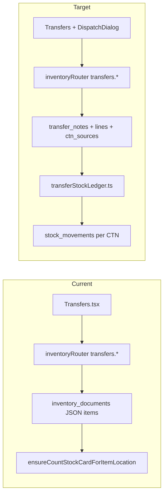

# Phase 4c: CTN-Aware Transfers

## Goal

Move **new** transfer create / approve / dispatch / receive flows from legacy [`inventory_documents`](../../drizzle/schema.ts) JSON blobs to relational [`transfer_notes`](../../drizzle/schema.ts) + [`transfer_note_lines`](../../drizzle/schema.ts) + [`transfer_note_line_ctn_sources`](../../drizzle/schema.ts), with CTN-level ledger writes via [`server/wms/transferStockLedger.ts`](../../server/wms/transferStockLedger.ts).

**Out of scope (deferred):** bulk backfill of existing `inventory_documents` transfer notes. Legacy rows remain readable via dual-read; new rows write only to relational tables.

**Independent of:** Phase 4d (`distributions.waybill_id` FK) — see [`4d-distributions-waybill-fk-migration.md`](./4d-distributions-waybill-fk-migration.md).

---

## Current vs Target

---

## Decisions

| Decision | Choice |
|----------|--------|
| Relational model | Separate `transfer_notes` family (not waybills) |
| CTN timing | Dispatch-time FEFO + optional override |
| Legacy backfill | Deferred — dual-read list/get |
| ID collision | `source: "relational" \| "legacy"` on all mutations |
| Receive CTNs | Same CTNs as dispatch sources |

---

## Schema (migration `0053`)

- `transfer_note_status` enum: `pending_approval`, `approved`, `dispatched`, `completed`
- `transfer_notes`, `transfer_note_lines`, `transfer_note_line_ctn_sources`

---

## API surface

| Procedure | Behavior |
|-----------|----------|
| `transfers.create` | Writes relational header + lines only |
| `transfers.approve` | `{ id, source }` — relational or legacy |
| `transfers.allocateDispatch` | FEFO preview per line (relational only) |
| `transfers.dispatch` | Persist CTN sources + `dispatchTransferLedger` |
| `transfers.receive` | `receiveTransferLedger` from persisted sources |
| `transfers.list` | Union relational + legacy with `source` |
| `transfers.get` | Normalized detail DTO |

---

## Audit actions

- `inventory.transfer_created`
- `inventory.transfer_approved`
- `inventory.transfer_dispatched`
- `inventory.transfer_received`

---

## Acceptance

1. New transfer create persists to `transfer_notes` + `transfer_note_lines`.
2. Approve → `approved`; only then dispatch is allowed in UI.
3. Dispatch auto-allocates FEFO CTNs, allows override in dialog, writes `transfer_out` per CTN stock card.
4. Receive writes `transfer_in` for same CTNs at destination.
5. Legacy transfer notes visible; legacy dispatch/receive still works via `source=legacy`.
6. `pnpm check` + tests pass.

---

## Deploy

1. Apply migration `0053_transfer_notes_relational.sql`.
2. Smoke test: create → approve → dispatch (FEFO dialog) → receive on staging warehouse pair.
