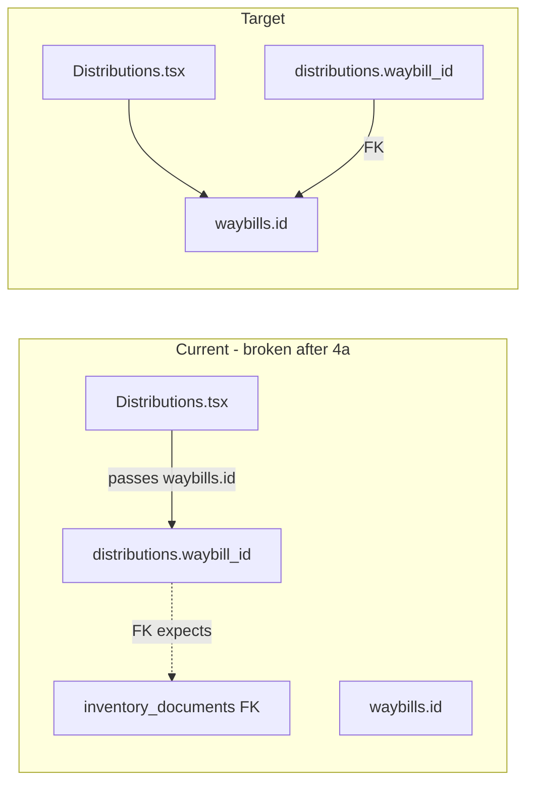

# Phase 4d: Distributions FK Repoint

## Goal

Repoint `distributions.waybill_id` from legacy [`inventory_documents`](../../drizzle/schema.ts) to relational [`waybills`](../../drizzle/schema.ts) so distribution create/list flows align with Phase 4a fulfill (relational waybills only).

**Blocker for Phase 6:** `inventory_documents` cannot be dropped while this FK still references it ([`docs/inventory-ledger-architecture.md`](../inventory-ledger-architecture.md)).

**Independent of:** Phase 4b (GRN) and 4c (transfers).

---

## Phase 4d: Distributions FK Repoint

### A. Current State Analysis

| Item | Finding |
|------|---------|
| Table | [`distributions`](../../drizzle/schema.ts) — `waybill_id` **nullable** |
| Current FK | `distributions_waybill_id_inventory_documents_id_fk` → `inventory_documents(id)` |
| ON DELETE | `NO ACTION` |
| ON UPDATE | `NO ACTION` |
| Index | `idx_distributions_waybill_id` (migration `0042`) |
| UI | [`Distributions.tsx`](../../client/src/pages/inventory/Distributions.tsx) loads `inventoryV2.waybills.list` and passes `waybills.id` |
| Router | [`inventoryV2.distributions.create`](../../server/routers/inventoryRouter.ts) inserts `waybillId` as-is — **no join to `inventory_documents` in app code** |
| Waybill match key | `inventory_documents.document_number` = `waybills.wb_number` (not `waybill_number`) |

**Runtime counts (run before migration):**

```bash
node scripts/analyze-4d-backfill.mjs
```

Expected output fields:

| Metric | Meaning |
|--------|---------|
| `totalDistributions` | All distribution rows |
| `withWaybillId` | Rows with non-null `waybill_id` |
| `withoutWaybillId` | Distributions not linked to a waybill (allowed) |
| `matchableViaLegacyDocNumber` | Legacy `inventory_documents` waybill → can map to `waybills` via `wb_number` |
| `alreadyStoresWaybillsId` | `waybill_id` already equals `waybills.id` (post-4a inserts that bypassed FK or ID collision) |
| `orphanedAfterBackfill` | Would remain unresolvable after backfill → set `NULL` + manual review |
| `invalidFkReferences` | `waybill_id` points to neither legacy doc nor relational waybill |

> **Note:** Live DB counts are environment-specific. Run `analyze-4d-backfill.mjs` on staging/production shadow before applying `0054`.



---

### B. Backfill SQL

**Match strategy (priority order):**

1. If `waybill_id` already exists in `waybills.id` → keep (already relational).
2. Else if `waybill_id` is legacy `inventory_documents` waybill → map via `document_number = wb_number`.
3. Else → set `waybill_id = NULL`, log for manual review.

**Pre-migration analysis queries** (also in [`scripts/analyze-4d-backfill.mjs`](../../scripts/analyze-4d-backfill.mjs)):

```sql
-- Distributions with a waybill link
SELECT count(*) FROM distributions WHERE waybill_id IS NOT NULL;

-- Matchable via legacy document_number → waybills.wb_number
SELECT count(*)
FROM distributions d
JOIN inventory_documents idoc ON d.waybill_id = idoc.id AND idoc.document_type = 'waybill'
JOIN waybills w ON w.wb_number = idoc.document_number;

-- Orphaned (legacy doc, no relational waybill with same number)
SELECT d.id, d.distribution_number, idoc.document_number
FROM distributions d
JOIN inventory_documents idoc ON d.waybill_id = idoc.id AND idoc.document_type = 'waybill'
WHERE NOT EXISTS (SELECT 1 FROM waybills w WHERE w.wb_number = idoc.document_number);
```

**Migration `0054` (recommended: in-place repoint in one transaction)**

File: `drizzle/0054_distributions_waybill_fk_repoint.sql`

```sql
-- Phase 4d: Repoint distributions.waybill_id → waybills(id)

-- 1) Drop legacy FK (required before rewriting IDs)
ALTER TABLE "distributions" DROP CONSTRAINT IF EXISTS "distributions_waybill_id_inventory_documents_id_fk";

-- 2) Backfill: legacy inventory_documents waybill → relational waybills.id
UPDATE "distributions" d
SET "waybill_id" = w.id
FROM "inventory_documents" idoc
INNER JOIN "waybills" w ON w.wb_number = idoc.document_number
WHERE d.waybill_id = idoc.id
  AND idoc.document_type = 'waybill';

-- 3) Null orphans (legacy doc with no matching relational waybill)
UPDATE "distributions" d
SET "waybill_id" = NULL
FROM "inventory_documents" idoc
WHERE d.waybill_id = idoc.id
  AND idoc.document_type = 'waybill'
  AND NOT EXISTS (SELECT 1 FROM "waybills" w WHERE w.wb_number = idoc.document_number);

-- 4) Null dangling references (invalid legacy IDs)
UPDATE "distributions" d
SET "waybill_id" = NULL
WHERE d.waybill_id IS NOT NULL
  AND NOT EXISTS (SELECT 1 FROM "waybills" w WHERE w.id = d.waybill_id);

-- 5) Add new FK to relational waybills
DO $$ BEGIN
  ALTER TABLE "distributions"
    ADD CONSTRAINT "distributions_waybill_id_waybills_id_fk"
    FOREIGN KEY ("waybill_id") REFERENCES "public"."waybills"("id")
    ON DELETE SET NULL ON UPDATE NO ACTION;
EXCEPTION
  WHEN duplicate_object THEN NULL;
END $$;
```

**Alternative (staged column)** — use only if you need a non-breaking validation window:

1. Add `relational_waybill_id` nullable column.
2. Backfill into staging column.
3. Validate counts; wait 48h.
4. Drop old FK + `waybill_id`, rename `relational_waybill_id` → `waybill_id`, add new FK.

The in-place approach above is preferred for this codebase (small `distributions` table, ~5 min maintenance window).

---

### C. Schema Update

**Current** ([`drizzle/schema.ts`](../../drizzle/schema.ts)):

```typescript
waybillId: integer("waybill_id").references(() => inventoryDocuments.id),
```

**Target:**

```typescript
waybillId: integer("waybill_id").references(() => waybills.id, { onDelete: "set null" }),
```

No router/UI signature changes — column name unchanged; semantics become `waybills.id`.

**Optional hardening** (Ticket 3): validate `waybillId` exists in `waybills` on `distributions.create` when provided.

---

### D. Execution Plan

| Stage | Action | Breaking? | Est. time |
|-------|--------|-----------|-----------|
| **0** | Run `node scripts/analyze-4d-backfill.mjs` on staging | No | 5 min |
| **1** | Dry-run backfill in transaction + `ROLLBACK` on staging | No | 15 min |
| **2** | Apply `0054` on staging | Yes (brief lock) | 5 min |
| **3** | Run `node scripts/verify-0054.mjs` | No | 2 min |
| **4** | Smoke: create distribution linked to dispatched waybill from 4a fulfill | No | 10 min |
| **5** | Apply `0054` on production (maintenance window) | Yes | ~5 min |
| **6** | Monitor 48h; keep legacy `inventory_documents` waybills until verified | No | — |

**Production window (Stages 2/5):** single transaction; `distributions` table locked during FK drop + UPDATE + ADD CONSTRAINT. Estimate **~5 minutes** for typical row counts.

**Commit checklist:**

- [ ] `drizzle/0054_distributions_waybill_fk_repoint.sql`
- [ ] `drizzle/meta/_journal.json` entry
- [ ] `drizzle/schema.ts` FK target update
- [ ] `scripts/verify-0054.mjs`
- [ ] Optional: `distributions.create` waybill existence check

---

### E. Rollback Procedure

**Before production (staging failed):**

1. Revert git commit containing `0054` + schema change.
2. Re-apply previous migration state or restore DB snapshot.

**After production `0054` applied:**

1. **Do not** re-add FK to `inventory_documents` without reversing backfill (relational IDs would violate legacy FK).
2. Rollback path:
   - Restore DB from pre-migration backup, **or**
   - Manual reverse only if you captured `distribution_id → old_waybill_id` mapping pre-migration (not automated — prefer backup).
3. Keep legacy `inventory_documents` waybill rows until 48h validation passes (no drop in 4d).

---

### F. Verification Queries

**Post-migration (`scripts/verify-0054.mjs`):**

```sql
-- New FK exists
SELECT 1 FROM pg_constraint
WHERE conname = 'distributions_waybill_id_waybills_id_fk';

-- Old FK gone
SELECT count(*) = 0 AS old_fk_gone
FROM pg_constraint
WHERE conname = 'distributions_waybill_id_inventory_documents_id_fk';

-- No orphan waybill_id values
SELECT count(*) AS orphan_count
FROM distributions d
WHERE d.waybill_id IS NOT NULL
  AND NOT EXISTS (SELECT 1 FROM waybills w WHERE w.id = d.waybill_id);

-- Spot-check join
SELECT d.distribution_number, w.wb_number, w.status
FROM distributions d
LEFT JOIN waybills w ON w.id = d.waybill_id
WHERE d.waybill_id IS NOT NULL
LIMIT 10;
```

**Application smoke:**

1. Fulfill requisition (4a) → dispatched waybill appears in distribution form dropdown.
2. Create distribution with that waybill → no FK error.
3. `inventoryV2.distributions.get` returns row with `waybillId` matching `waybills.id`.

---

### G. Risk Summary

| Risk | Likelihood | Mitigation |
|------|------------|------------|
| Orphaned distributions (no matching `waybills`) | Medium in old data | Backfill sets `NULL`; `analyze-4d-backfill.mjs` lists orphans pre-migration |
| ID collision (`waybills.id` = `inventory_documents.id` different entities) | Low | Backfill only rewrites rows joined to legacy waybill docs; already-relational IDs kept |
| Brief write lock on `distributions` | Certain during migration | ~5 min maintenance window |
| Reports joining `waybill_id` → `inventory_documents` | Low | Grep shows no server joins; only `waybill_id` stored |
| New distributions fail FK until migration applied | **High post-4a** | Execute 4d immediately after 4c validation |

**Downtime:** ~5 minutes for Stage 2/5 transaction.

**Rollback:** DB restore preferred; revert commit pre-prod only.

---

## Tickets

### Ticket 1 — Analysis tooling (~1h)

- [`scripts/analyze-4d-backfill.mjs`](../../scripts/analyze-4d-backfill.mjs) — pre-migration counts
- Run on staging; document counts in deploy notes

### Ticket 2 — Migration + schema (~2h)

- `drizzle/0054_distributions_waybill_fk_repoint.sql`
- Update [`drizzle/schema.ts`](../../drizzle/schema.ts) + journal
- [`scripts/verify-0054.mjs`](../../scripts/verify-0054.mjs)

### Ticket 3 — API hardening (~1h)

- Optional: `distributions.create` — verify `waybillId` exists in `waybills` when set
- Log audit note when backfill orphans nulled (migration one-time script or manual)

### Ticket 4 — Tests + smoke (~2h)

- E2E: fulfill requisition → create distribution with waybill link
- Extend [`tests/features/inventory-workflow.spec.ts`](../../tests/features/inventory-workflow.spec.ts)

---

## Acceptance Criteria

1. `distributions.waybill_id` FK references `waybills(id)` with `ON DELETE SET NULL`.
2. Legacy distribution links backfilled via `document_number` = `wb_number` where possible.
3. Unmatchable legacy links set to `NULL` (logged / counted pre-migration).
4. Distribution create with Phase 4a dispatched waybill succeeds (no FK violation).
5. `verify-0054.mjs` passes on staging and production post-apply.
6. `pnpm check` passes after Drizzle schema update.

---

## Dependencies

| Phase | Status | Relevance |
|-------|--------|-----------|
| 4a | Done | Fulfill writes relational `waybills` |
| 4b | Done | Independent |
| 4c | Done | Independent |
| Phase 6 | Blocked until 4d | Drop `inventory_documents` |

---

## Effort Estimate

| Area | Hours |
|------|-------|
| Analysis + migration SQL | 3 |
| Schema + verify script | 2 |
| API hardening + E2E | 3 |
| Staging/prod execution | 2 |
| **Total** | **~10h (~1 dev day)** |

---

## Parallel execution with 4c

4c and 4d touch disjoint tables (`transfer_notes` vs `distributions` FK). Safe to run in parallel; coordinate production deploy order:

1. Apply `0053` (4c transfers)
2. Smoke 4c
3. Apply `0054` (4d FK repoint)
4. Smoke distribution + waybill link
