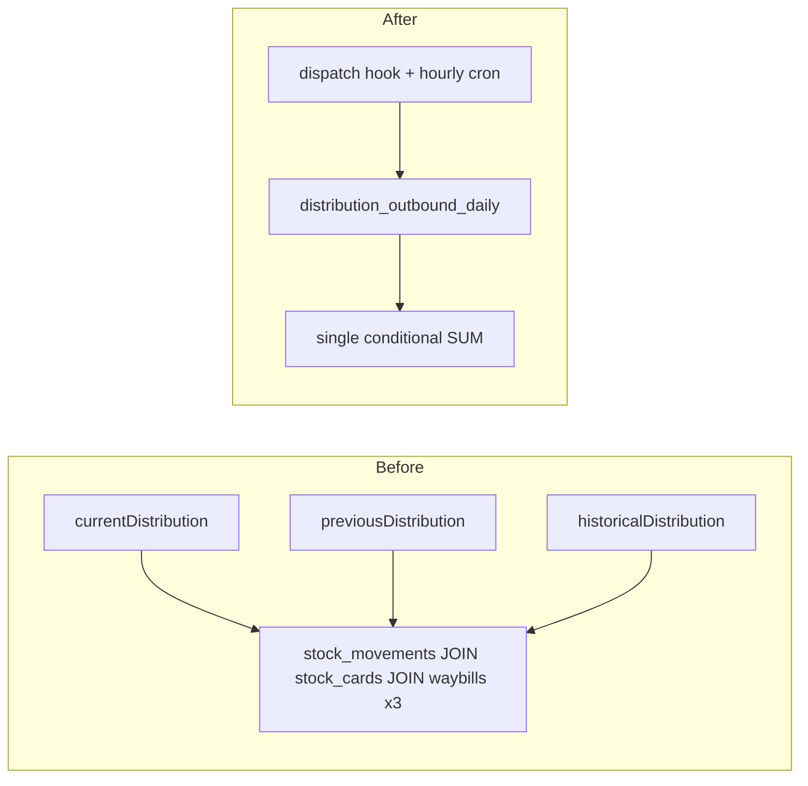

# Phase 4e: Distribution Velocity Materialized View

## Goal

Speed up the **Distribution Velocity** dashboard KPI by pre-aggregating waybill distribution outbound quantities into `distribution_outbound_daily`, replacing three heavy join queries with a single MV scan.

**Independent of:** Phase 4b (GRN), 4c, 4d.

---

## Current vs Target

---

## Schema

Migration [`drizzle/0052_distribution_velocity_mv.sql`](../../drizzle/0052_distribution_velocity_mv.sql):

- MV grain: `(movement_date, location_id)` → `total_out`
- Filter: `source_type = 'waybill'`, `destination_type IN ('beneficiary', 'distribution_point')`
- `refresh_distribution_outbound_daily(concurrent_refresh boolean)`

---

## Backend

| File | Role |
|------|------|
| [`server/_core/distributionVelocityMv.ts`](../../server/_core/distributionVelocityMv.ts) | MV availability probe, refresh helpers, `refreshDashboardMaterializedViews` |
| [`server/wms/distributionVelocity.ts`](../../server/wms/distributionVelocity.ts) | `queryDistributionVelocityTotals` — MV path + join fallback |
| [`server/routers.ts`](../../server/routers.ts) | `dashboard.metrics` — 1 subquery instead of 3 |
| [`server/wms/waybillStockLedger.ts`](../../server/wms/waybillStockLedger.ts) | Fire-and-forget MV refresh after dispatch |
| [`api/cron/hourly-mv-refresh.ts`](../../api/cron/hourly-mv-refresh.ts) | Hourly refresh of distribution + stock_card_balances MVs |

---

## Refresh strategy

| Trigger | Schedule |
|---------|----------|
| Waybill dispatch | Non-blocking after `dispatchWaybillLedger` |
| Vercel cron | `0 * * * *` → `/api/cron/hourly-mv-refresh` |

---

## Deploy

1. Apply migration `0052`
2. `node scripts/verify-0052.mjs`
3. `SELECT refresh_distribution_outbound_daily(false);` if needed on empty MV
4. Validate dashboard Distribution Velocity KPI (all period toggles)

---

## Acceptance

1. MV exists and returns rows
2. `dashboard.metrics` KPI shape unchanged
3. Site-scoped and org-wide filters work via `location_id`
4. Dispatch + hourly cron refresh without errors
5. `pnpm check` passes

---

## Effort

~1 dev day (4 tickets)
