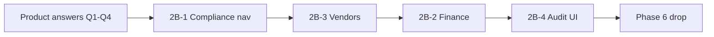

# Deletion Candidate Register — Tier 2B

**Audit date:** 2026-06-15  
**Status:** **Completed** (2026-06-15) — immediate-delete policy; migration `0056_tier_2b_retirement.sql` (direct drops, no archives). See [TIER-2B-RETIREMENT.md](./TIER-2B-RETIREMENT.md).  
**Prerequisite:** Tier 2 (Phase 6 `inventory_documents`) is independent — Tier 2B ran without Phase 6.  
**Policy:** ~~No deletions until each sub-tier is approved~~ **Executed atomically** — new routes added and legacy pages/backends removed in one change set; **no redirects**.

Companion: [deletion-candidate-register.md](./deletion-candidate-register.md) (Tier 0–4), [6-legacy-inventory-documents-retirement.md](./6-legacy-inventory-documents-retirement.md) (Phase 6).

---

## Scope summary

| Sub-tier | Theme | Risk | Schema drops? |
|----------|-------|------|----------------|
| **2B-1** | Compliance → Administration (route/nav consolidation) | Low | No |
| **2B-2** | Finance cleanup (keep depreciation report only) | Medium | Yes (direct drop) |
| **2B-3** | Vendors retirement | Low | Yes (direct drop; `inventoryItems.vendorId` removed) |
| **2B-4** | Audit UI consolidation | Medium | No — keep `auditLogs` table |

---

## Open product decisions (defaults proposed)

Answer before execution. **Recommended defaults** are marked *(R)*.

### Q1 — Compliance admin layout

- [ ] **(R) A)** Single page `/app/administration/compliance-register` with tabs: Vehicles | Generators | Buildings | Donors | Insurance  
- [ ] **B)** Separate sub-routes under `/app/administration/compliance/*`

**Default if no answer:** **A**

### Q2 — Finance table retirement

| Table | Proposed action | Notes |
|-------|-----------------|-------|
| `financialTransactions` | **Direct drop** in migration `0056` | QBO sync target; no WMS FKs |
| `maintenance_costs` | **Direct drop** | Only cost-management / annual report |
| `budgets` | **Direct drop** | Budget vs actual only |
| `quickbooksConfig` | **(R) Drop with finance bundle** | Orphan if transactions removed |
| `assets` depreciation columns | **KEEP** | Report reads asset rows |
| `insurance_records` | **KEEP** | Compliance / annual report §5 |

**Default if no answer:** Archive-then-drop for all finance tables above; keep depreciation on `assets`.

### Q3 — Depreciation report destination

- [ ] **(R) A)** `/app/reports/depreciation-schedule` + keep `AssetDetail` depreciation card  
- [ ] **B)** `/app/reports/asset-depreciation`  
- [ ] **C)** Reports route only; remove full-page report

**Default if no answer:** **A**

### Q4 — Annual Finance Report

Current sections (no fund drawdown in code):

1. Asset valuation  
2. Depreciation  
3. Budget vs actual  
4. Maintenance costs  
5. Insurance summary  

- [ ] **(R) Slim:** Keep sections **2 + 5** only (depreciation + insurance); remove 1, 3, 4  
- [ ] **Delete entire page**  
- [ ] **Keep all sections**

**Default if no answer:** **Slim** (depreciation + insurance)

---

## Graphify validation matrix

Run from repo root (`graphify update .` first).

| Query / command | Result | Unexpected? |
|-----------------|--------|-------------|
| `graphify query "complianceTracking"` | `complianceTrackingDb`, `complianceTrackingRouters`, `Compliance.tsx`, `routers.ts`, `financeModulesDb` (shared db import) | No |
| `graphify affected "complianceTrackingDb"` | `complianceTrackingRouters.ts`, `routers.ts` (+ app router fan-out) | No — dashboard uses `count*` from same module via `routers.ts` |
| `graphify path "complianceTracking" "auditHelper"` | No direct path | No — compliance does not write audit today |
| `graphify query "financeModulesDb"` | `financeRouters.ts`, `annualFinanceReportPdf.ts`, `financeExcelExports.ts`, `routers.ts` | No |
| `graphify affected "financeModulesDb"` | Same + client finance pages via tRPC | No |
| `graphify affected "financialTransactions"` | `db.ts`, `financeModulesDb.ts`, `quickbooksIntegration.ts`, `lifecycleCost.ts`, scripts | Broad schema import fan-out — **verify callers**, not all are finance |
| `graphify query "costManagement"` | `costManagementRouter` in `financeRouters.ts` | No |
| `graphify query "vendors"` | `vendors` table, `Vendors.tsx`, `seed-sample-data.mjs` | No |
| `graphify path "vendors" "getCostAnalytics"` | 5 hops: `Vendors` → `trpc` → `routers` → `db.getCostAnalytics` | Expected — cost analytics only |
| `graphify query "auditLogs"` | `schema.ts`, `db.ts`, `routers.ts`, `observabilityRouter.ts` | No |
| `graphify path "auditLogs" "observabilityRouter"` | 2 hops | Dashboard failed-logins + observability |

**WMS / Phase 6:** None of the Tier 2B modules are in the `inventory_documents` dual-read path.

---

## Register

| ID | Sub-tier | Category | Path / asset | Blockers | Graphify | Approved |
|----|----------|----------|--------------|----------|----------|----------|
| 2B-001 | 2B-1 | Nav | `appNav` compliance group → administration | Q1 layout | — | N |
| 2B-002 | 2B-1 | Routes | `/app/compliance`, `/app/compliance/insurance` | Redirects to admin path | — | N |
| 2B-003 | 2B-1 | Page | `Compliance.tsx` → move/rename under administration | Dashboard deep links | — | N |
| 2B-004 | 2B-1 | Page | `InsuranceRegister.tsx` (standalone route) | Merge into tab per Q1 | — | N |
| 2B-005 | 2B-1 | Dashboard | `dashboardNav` compliance URLs | Update to new paths | — | N |
| 2B-006 | 2B-1 | Legacy | `complianceRecords` + `trpc.compliance` | **No UI** — optional drop in 2B-2 or separate | — | N |
| 2B-007 | 2B-1 | KEEP | `complianceTracking` tables + router | Active data | Yes | N/A |
| 2B-008 | 2B-1 | KEEP | `insurance_records` + `insuranceRecords` router | Annual report §5 | Yes | N/A |
| 2B-009 | 2B-2 | Page | `Financial.tsx` | Q2 | — | N |
| 2B-010 | 2B-2 | Page | `finance/CostManagement.tsx` | Q2 | — | N |
| 2B-011 | 2B-2 | Page | `CostAnalytics.tsx` + redirect | Vendor slice removed with 2B-3 | Yes | N |
| 2B-012 | 2B-2 | Page | `finance/AssetValuation.tsx` | Q4 section 1 | — | N |
| 2B-013 | 2B-2 | Page | `QuickBooksSettings.tsx` + `quickbooks` router | Q2 | — | N |
| 2B-014 | 2B-2 | Page | `finance/DepreciationReporting.tsx` | **MOVE** to reports per Q3 | Yes | N |
| 2B-015 | 2B-2 | Router | `costManagement`, `financial` in `routers.ts` | After pages removed | Yes | N |
| 2B-016 | 2B-2 | Router | `depreciationReport` | **KEEP** — relocate nav only | Yes | N |
| 2B-017 | 2B-2 | Router | `annualFinanceReport` | Slim per Q4 | Yes | N |
| 2B-018 | 2B-2 | Schema | `financialTransactions` | Archive migration | Yes | N |
| 2B-019 | 2B-2 | Schema | `maintenance_costs` | Archive migration | Yes | N |
| 2B-020 | 2B-2 | Schema | `budgets` | Archive migration | Yes | N |
| 2B-021 | 2B-2 | Schema | `quickbooksConfig` | With QBO removal | — | N |
| 2B-022 | 2B-2 | KEEP | `assets` depreciation columns | Required for report | — | N/A |
| 2B-023 | 2B-2 | KEEP | `AssetDepreciation.tsx` on `AssetDetail` | Per Q3 | — | N/A |
| 2B-024 | 2B-3 | Page | `Vendors.tsx` | `/app/vendors`, `/app/settings/vendors` | Yes | N |
| 2B-025 | 2B-3 | Router | `trpc.vendors` | `eam.test.ts` | Yes | N |
| 2B-026 | 2B-3 | Schema | `vendors` table | Orphan `vendorId` on legacy rows (no FK) | Yes | N |
| 2B-027 | 2B-3 | UI slice | Cost analytics “Top Vendors” | Deleted with 2B-010/011 | Yes | N |
| 2B-028 | 2B-4 | Page | `AuditTrail.tsx` | Merge into Activity Log | Yes | N |
| 2B-029 | 2B-4 | Route | `/app/audit-trail` | Redirect to activity log | — | N |
| 2B-030 | 2B-4 | KEEP | `auditLogs` table + `auditLogs` router | Security / observability | Yes | N/A |
| 2B-031 | 2B-4 | KEEP | `auditHelper` + WMS audit actions | Phase 6 needs **new** events pre-drop | Yes | N/A |
| 2B-032 | 2B-4 | Prereq | Phase 6 inventory_documents audit | Add `logAuditEvent` before 0055 | — | N |

---

## Tier 2B-1 — Compliance consolidation (low risk)

**Goal:** Move compliance UX under Administration; **no schema changes**.

### Steps

1. Create `/app/administration/compliance-register` (single tabbed page per Q1-A).
2. Move content from `Compliance.tsx` + embed `InsuranceRegisterContent`.
3. Add redirects:
   - `/app/compliance` → new path (preserve `?tab=` query)
   - `/app/compliance/insurance` → `?tab=insurance`
4. Update `client/src/config/appNav.ts` — remove standalone Compliance group; add under Administration.
5. Update `shared/dashboardNav.ts` attention hrefs (insurance, vehicles, generators, donor).
6. Update `tests/mvp-audit` sidebar + entity page fixtures.
7. **Optional (same tier):** Drop orphan `complianceRecords` table + `trpc.compliance` router (no UI).

### Files touched (expected)

- `client/src/pages/Compliance.tsx` (move or re-export)
- `client/src/pages/compliance/InsuranceRegister.tsx`
- `client/src/components/ProtectedAppSection.tsx`
- `client/src/config/appNav.ts`
- `shared/dashboardNav.ts`
- `tests/mvp-audit/**`

### Verification

- `pnpm check`
- Dashboard attention links resolve
- MVP audit screenshots for compliance paths

---

## Tier 2B-2 — Finance cleanup (medium risk)

**Goal:** Remove manual finance ledger, cost management, QBO; **keep depreciation report** (moved to Reports).

**Blocked:** Recommended after Phase 6 go/no-go if same release train — not a hard code dependency.

### Pre-migration SQL (staging)

```sql
-- Row counts before archive
SELECT 'financialTransactions' AS t, COUNT(*) FROM "financialTransactions"
UNION ALL SELECT 'maintenance_costs', COUNT(*) FROM maintenance_costs
UNION ALL SELECT 'budgets', COUNT(*) FROM budgets
UNION ALL SELECT 'quickbooksConfig', COUNT(*) FROM "quickbooksConfig";
```

### Migration `0056_finance_archive.sql` (draft)

```sql
CREATE TABLE IF NOT EXISTS financial_transactions_archive AS SELECT * FROM "financialTransactions";
CREATE TABLE IF NOT EXISTS maintenance_costs_archive AS SELECT * FROM maintenance_costs;
CREATE TABLE IF NOT EXISTS budgets_archive AS SELECT * FROM budgets;

DROP TABLE IF EXISTS "financialTransactions";
DROP TABLE IF EXISTS maintenance_costs;
DROP TABLE IF EXISTS budgets;
DROP TABLE IF EXISTS "quickbooksConfig";
```

### Code removal checklist

| Area | Action |
|------|--------|
| Pages | Delete `Financial.tsx`, `CostManagement.tsx`, `CostAnalytics.tsx`, `AssetValuation.tsx`, `QuickBooksSettings.tsx` |
| Pages | Move `DepreciationReporting.tsx` → `reports/DepreciationSchedule.tsx` |
| Routers | Remove `financial`, `costManagement`, `quickbooks` from `routers.ts` |
| Routers | Keep `depreciationReport`; trim `financeModulesDb` to depreciation + insurance helpers |
| Routers | Slim `annualFinanceReport` to depreciation + insurance (Q4) |
| Server | Remove `quickbooksIntegration.ts`, QBO cron/sync hooks |
| Server | Remove `lifecycleCost` usage from financial router (or keep if asset detail uses it — verify) |
| Schema | Drop tables per migration; remove Drizzle exports |
| Nav | Remove finance group except reports link; add depreciation under Reports |
| Tests | Update `eam.test.ts`, MVP audit finance paths |
| Seed | Remove vendor/financial seed blocks if applicable |

### Keep

- `trpc.depreciationReport.*`
- `trpc.assets.recalculateDepreciation`
- `AssetDepreciation` component on `AssetDetail`
- `insurance_records` (compliance tier)

### Verification

- `pnpm check`
- Depreciation schedule loads at new reports URL
- Annual report generates (slim sections)
- No remaining imports of dropped tables (`rg financialTransactions maintenance_costs budgets quickbooksConfig`)

---

## Tier 2B-3 — Vendors deletion (low risk)

**Goal:** Remove vendor master data UI and table.

### Dependencies (verified)

| Consumer | Impact |
|----------|--------|
| `financialTransactions.vendorId` | Removed with 2B-2 |
| `inventoryItems.vendorId` | **Removed** in migration `0056` |
| `getCostAnalytics().byVendor` | Removed with 2B-2 |
| `seed-sample-data.mjs` | Remove vendor seed block |

### Steps

1. Delete `Vendors.tsx`, routes `/app/vendors`, `/app/settings/vendors`.
2. Remove `vendors` router from `routers.ts`.
3. Remove `createVendor` / `getAllVendors` / `updateVendor` from `db.ts` if unused.
4. Migration `0057_vendors_archive.sql` (optional): archive then drop `vendors`.
5. Remove nav entries from `appNav.ts`.
6. Update `eam.test.ts` vendors test.

### Verification

- `pnpm check`
- `rg "trpc\.vendors" client` → no matches

---

## Tier 2B-4 — Audit UI consolidation (medium risk)

**Goal:** One admin audit UI; **retain `auditLogs` table** and all writers.

### Current state

| Page | API | Features |
|------|-----|----------|
| `AuditTrail.tsx` | `auditLogs.list` | Entity-type filter, search, card layout, admin-only |
| `ActivityLog.tsx` | `auditLogs.list` | Pagination, date range, user, action, facility, table |

**No `activity_log` table** in schema (legacy cleanup only in `full-reset.ts`).

### Merge strategy *(R)*

1. Enhance `ActivityLog.tsx` with entity-type filter + search from Audit Trail.
2. Redirect `/app/audit-trail` → `/app/administration/activity-log`.
3. Delete `AuditTrail.tsx`.
4. Update `dashboardNav.auditTrail` href.
5. **Do not** remove `observabilityRouter` audit reads.

### Phase 6 prerequisite (2B-032)

Before `inventory_documents` drop, add audit events:

```typescript
// Example — log before archive migration
await logAuditEvent({
  userId: ctx.user.id,
  action: "inventory.phase6.archive_inventory_documents",
  entityType: "inventory_documents",
  changes: { rowCount, migration: "0055" },
  req: ctx.req,
});
```

`auditLogs` does **not** today record per-row `inventory_documents` mutations.

### Verification

- Failed-login dashboard link works
- Observability auth-failure metric unchanged
- Admin can filter inventory-related actions after Phase 6 logging added

---

## Approval gates

| Sub-tier | Execute when | Approved |
|----------|--------------|----------|
| **2B-1** | Anytime after Q1 | N |
| **2B-2** | Q2 + Q3 + Q4 answered; recommend after Phase 6 go | N |
| **2B-3** | Anytime; best after 2B-2 (cost analytics gone) | N |
| **2B-4** | Anytime for UI merge; 2B-032 before Phase 6 drop | N |

---

## Execution order (recommended)



1. **2B-1** — compliance admin move (no schema)  
2. **2B-3** — vendors (low coupling)  
3. **2B-2** — finance tables + pages (archive migrations)  
4. **2B-4** — merge audit UI; add Phase 6 audit events  
5. **Phase 6** — `inventory_documents` retirement (separate register)

---

## Success criteria

- [ ] Graphify matrix recorded (above)
- [ ] Product sign-off on Q1–Q4 defaults or alternatives
- [ ] `pnpm check` after each sub-tier
- [ ] MVP audit / targeted E2E updated for moved routes
- [ ] Archive migrations applied on staging before prod drops
- [ ] Dashboard attention links valid after 2B-1
- [ ] Depreciation report reachable at `/app/reports/depreciation-schedule`
- [ ] Single audit UI; `auditLogs` writers unchanged
