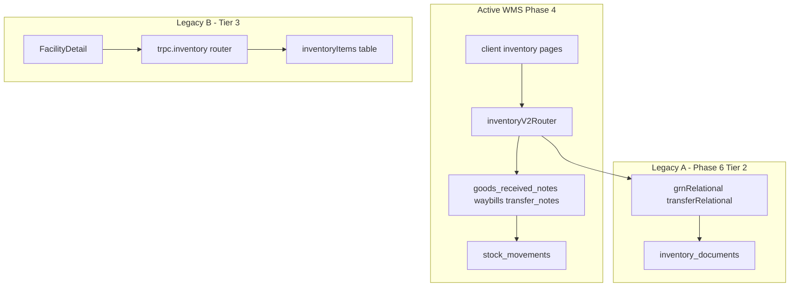

# Deletion Candidate Register

**Audit date:** 2026-06-15  
**Base commit:** `707170a`  
**Policy:** No code or schema is deleted until each tier is explicitly approved (Approved = Y).

## Approval gates

| Tier | When | Approved |
|------|------|----------|
| 0 — Docs only | Anytime | N |
| 1 — Safe fixes | After quick verify | N |
| 2 — Phase 6 bundle | 48h go/no-go + tier approval | N |
| 3 — Legacy `inventoryItems` | Separate sprint + product approval | N |
| 4 — Bloat sweep | After Tier 2–3 | N |
| 5 — Product decision | Explicit sign-off | N |

---

## Register

| ID | Category | Path / asset | Tier | Blockers | Graphify verified | Approved |
|----|----------|--------------|------|----------|-------------------|----------|
| D-001 | Phase artifacts | `server/routers/*.v2.ts` (Phase 4f) | — | **Not found** — only `inventoryV2Router` in `inventoryRouter.ts` | N/A | N/A |
| D-002 | Phase artifacts | Migrations `0001`–`0054` | KEEP | Production version history | N/A | N/A |
| D-003 | Phase artifacts | `inventory_movements` table | DONE | Dropped in `0019` | N/A | N/A |
| D-004 | Phase artifacts | `inventory_stock` table | DONE | Dropped in `0024`; runtime migrated | N/A | N/A |
| D-005 | Docs | `docs/planning/tech-debt.md` L3 stale `inventory_stock` report bullet | 0 | None — `stockStatus` uses `stock_movements` | N/A | N |
| D-006 | Docs | Untracked planning docs (`6-legacy-inventory-documents-retirement.md`, `nrcs-eam-system-overview.md`) | 0 | Optional commit | N/A | N |
| D-007 | Scripts | `scripts/db/apply-ifrc-catalogue-audit.ts` — `inventoryStock` import | 1 | Table dropped; cascade must use `stock_settings` + `catalogueId` | N/A | N |
| D-008 | Dual-read | `inventory_documents` table | 2 | 48h validation; writers `issueAsKit`, `disposeExpired`; `nextDocumentNumber` | Yes | N |
| D-009 | Dual-read | `server/wms/grnRelational.ts` legacy mappers | 2 | Phase 6 bundle | Yes — 1 hop from `inventoryRouter` | N |
| D-010 | Dual-read | `server/wms/transferRelational.ts` + `legacyTransferDispatch` | 2 | Phase 6 bundle | Yes — 1 hop from `inventoryRouter` | N |
| D-011 | Dual-read | `nextDocumentNumber()` legacy scan | 2 | Repoint to relational tables first | — | N |
| D-012 | Dual-read | `server/routes/documents.ts` GRN export by legacy id | 2 | Relational id path required | Yes — imports `inventoryDocuments` | N |
| D-013 | Dual-read | Client `source=legacy` (`Receipts`, `ReceiptDetail`, `Transfers`) | 2 | Phase 6 bundle | N/A | N |
| D-014 | Dual-read | `issueAsKit` → `inventory_documents` insert (~L3485) | 2 | Migrate to relational waybills (6b) | — | N |
| D-015 | Dual-read | `disposeExpired` → `inventory_documents` insert (~L5125) | 2 | Migrate to relational waybills (6b) | — | N |
| D-016 | Legacy inventory | `inventoryItems` table + `trpc.inventory` router | 3 | FacilityDetail, dashboard low-stock, notifications, search | — | N |
| D-017 | Legacy inventory | `trpc.inventory` mutations (`create`, `update`, `submitStockCount`, `lowStock`) | 3 | No client callers; safe after D-016 | — | N |
| D-018 | Feature bloat | `BulkActionsToolbar.tsx` | 4 | Documented in ENHANCEMENTS_STATUS; never wired | N/A | N |
| D-019 | Feature bloat | `ManusDialog.tsx` | 4 | No imports from pages/App | N/A | N |
| D-020 | Feature bloat | `icons/NairaIcon.tsx` | 4 | No imports from pages/App | N/A | N |
| D-021 | Dependencies | Stale imports after Dependabot removals | 4 | `pnpm check` passed 2026-06-15 | N/A | N |
| D-022 | Integration | QuickBooks module | 5 KEEP | Live UI + router + E2E | N/A | N/A |
| D-023 | Integration | Financial / Cost analytics | 5 KEEP | Product decision | N/A | N/A |
| D-024 | Integration | `trpc.transfers` (asset transfers) | 5 KEEP | FacilityDetail; distinct from WMS | N/A | N/A |
| D-025 | Integration | Mobile work orders | 5 KEEP | Responsive web routes | N/A | N/A |
| D-026 | Active — do not delete | `inventoryV2` router | KEEP | All WMS pages | N/A | N/A |
| D-027 | Active — do not delete | Observability stack | KEEP | Phase 6 validation metrics | N/A | N/A |
| D-028 | Active — do not delete | `dispatchWaybillLedger` / MV refresh | KEEP | Production dashboard | N/A | N/A |
| D-029 | Active — do not delete | PDF/CSV export mutations | KEEP | Receipts, requisitions, distributions, reports | N/A | N/A |
| D-030 | Ops scripts | `analyze-4d-backfill.mjs`, `verify-0052.mjs`, `verify-0054.mjs` | KEEP | Ops validation | N/A | N/A |
| D-031 | Ops scripts | `analyze-6-inventory-documents.mjs` | KEEP | Phase 6 pre-cutover (added) | N/A | N/A |
| D-032 | Test / demo | `server/eam.test.ts` `inventory.lowStock` | 3 | Update when legacy router removed | — | N |
| D-033 | Test / demo | `server/emailService.ts` stub | KEEP | Dev/no-SMTP fallback | N/A | N/A |
| D-034 | Test / demo | `server/routes/setup.ts` health | KEEP | Health/setup endpoint | N/A | N/A |

---

## Graphify verification (Tier 2)

Run from repo root (`graphify update .` prerequisite):

```
graphify affected "inventoryDocuments"
→ inventoryRouter.ts, documents.ts, grnRelational.ts, transferRelational.ts
  (+ routers.ts, apiApp.ts via imports_from)

graphify path "grnRelational" "inventoryRouter"     → 1 hop (imports_from)
graphify path "transferRelational" "inventoryRouter" → 1 hop (imports_from)
graphify path "documents.ts" "inventoryDocuments"   → 1 hop (imports)
```

No unexpected dependents beyond the planned Phase 6 bundle.

---

## Client procedure usage (verified)

```text
trpc.inventory.*     → FacilityDetail.tsx only (list, movements)
trpc.inventoryV2.*   → All WMS inventory pages (Receipts, Transfers, Requisitions, etc.)
```

PowerShell audit commands:

```powershell
rg "inventoryV2\.\w+" client -o | Sort-Object -Unique
rg "trpc\.inventory\." client -o | Sort-Object -Unique
```

---

## Server write scan (legacy tables)

```powershell
rg "insert\(inventoryDocuments\)|\.insert\(inventoryDocuments\)" server
# → issueAsKit, disposeExpired (inventoryRouter.ts)

rg "insert\(inventoryItems\)" server
# → legacy inventory router paths (Tier 3)
```

---

## Tier 2 — Phase 6 execution checklist (blocked)

**Prerequisites:** 48h production validation go/no-go per [6-legacy-inventory-documents-retirement.md](./6-legacy-inventory-documents-retirement.md):

- Cache hit rate > 30%
- No 4a–4e regressions
- FK integrity verified
- Latency < 2800ms

**Tickets (do not start until Approved = Y for Tier 2):**

1. Run `node scripts/analyze-6-inventory-documents.mjs` on staging
2. Migrate `issueAsKit` + `disposeExpired` to relational waybills (6b)
3. Repoint `nextDocumentNumber` to relational tables (6c)
4. Remove dual-read + client `source=legacy` paths (6d)
5. Migration `0055` archive + schema cleanup (6e)
6. E2E `tests/features/inventory-workflow.spec.ts`

Full detail: [6-legacy-inventory-documents-retirement.md](./6-legacy-inventory-documents-retirement.md)

---

## Tier 3 — Legacy `inventoryItems` migration plan (blocked)

**Scope:** Separate from Phase 6 (`inventory_documents`). Legacy `inventoryItems` powers facility-level stock tab and dashboard attention items.

### Current dependents

| Consumer | Path | Procedures / APIs |
|----------|------|-------------------|
| Facility inventory tab | `client/src/pages/FacilityDetail.tsx` | `trpc.inventory.list`, `trpc.inventory.movements` |
| Dashboard low stock | `server/routers.ts` ~L2386 | `getLowStockItems()` |
| Notifications | `server/notificationHelper.ts` | Low-stock alerts |
| Branch reports | `server/reports/branchSummary.ts` | Inventory slice |
| Global search | `server/db.ts` ~L1927 | Inventory search |

### Migration steps (plan only)

1. **FacilityDetail** — Replace `trpc.inventory.list` with `inventoryV2.stock.list` (or facility-scoped stock aggregate). Replace `movements` with `inventoryV2` stock movement query filtered by `warehouseId` = facility site.
2. **Dashboard** — Repoint `getLowStockItems()` to `stock_settings` min levels vs `stock_movements` on-hand aggregates (same logic as `inventoryV2.reports.stockStatus`).
3. **Notifications / reports / search** — Switch reads to `inventory_catalogue` + `stock_settings` + movement aggregates.
4. **Router cleanup** — Remove unused `trpc.inventory` procedures: `create`, `update`, `submitStockCount`, `lowStock` (no client callers).
5. **Schema** — Data audit on `inventoryItems` / `inventoryTransactions`; retirement migration after zero writers.
6. **Tests** — Update `server/eam.test.ts` `inventory.lowStock` to WMS equivalent.

### Approval required before any deletion

- Product sign-off on FacilityDetail UX parity
- Confirm no external integrations read `inventory_items`
- Staging validation of dashboard attention counts

---

## Tier 4 — Orphan component scan (2026-06-15)

Method: export components under `client/src/components/` (excluding `ui/`) with no import from `client/src/pages/` or `App.tsx`.

| Component | Status | Recommendation |
|-----------|--------|----------------|
| `BulkActionsToolbar.tsx` | Orphan | Tier 4 — delete or wire per ENHANCEMENTS_STATUS |
| `ManusDialog.tsx` | Orphan | Tier 4 — delete if Manus integration retired |
| `icons/NairaIcon.tsx` | Orphan | Tier 4 — delete or use in Financial UI |
| `ModuleFiltersCard.test.tsx` | False positive | KEEP — tests `ModuleFiltersCard` |

### Dependabot / stale import verification

`pnpm check` (tsc --noEmit) **passed** on 2026-06-15. No compile-time stale imports detected. Runtime script `apply-ifrc-catalogue-audit.ts` fixed separately (D-007).

---

## Architecture reference



---

## Success criteria

- [x] Register exists with tier + approval column
- [x] Tier 2 modules graphify-verified
- [x] Tier 0 doc fix applied
- [x] Tier 1 script fix applied
- [x] Tier 2 blocked with checklist + analyze script
- [x] Tier 3 migration plan documented
- [x] Tier 4 orphan scan + `pnpm check` documented
- [ ] Tier 2–4 deletions (awaiting per-tier approval)
